**Section 1: Getting Started**

**Top Navigation**

The navigation bar on the top of the application is always visible and accessible to the user. There are 4 main screens, i.e., Dashboard, Browse, Notifications, and Import.

**Understanding the Top Navigation bar** 

**Terms and Definitions to get started with understanding JeMPI**

**Blocking**: Reducing the search space by grouping records by similar attributes into blocks.

**Candidate records**: A short list of Golden Records generated as a result of blocking. The records on this short list are referred to as candidate (golden) records, as they are potential candidates for linking.

**Patient Interaction record**: Stores demographic information of the patient e.g. name, surname, DOB, gender, address, etc.  This information together with the unique source system ID is used to uniquely identify patients. 

**Patient ID**: Unique identifier of the patient record assigned by the JeMPI upon entry.

**Golden record (GR)**: A golden record is created for a patient if this is the first and/or only patient record to be stored in the database. This is the same as a master record. The golden record links records based on a match score, i.e., determines that 2 or more patient records belong to the same person.

Always has the most up-to-date information for a patient by consensus among the golden record's interactions.

**Golden ID**: Unique identifier of the Golden record.  

**Link Threshold (LTH)**: Predetermined values that allocate the match status of two records based on the probabilistic score generated by the comparison algorithm.
**M & U values**: The matching (M) and unmatching (U) values derived for each record field. 
- The m values can be expressed as data quality and  calculated as the ratio of matching attributes given that they belong to the same record.
- The u values can be expressed as data uniqueness and calculated as the ratio of matching values given that they do not belong to the same record.
 -Because the status of matching records is unknown, m and u values are calculated using the Expectation 
Maximization algorithm.

**Matching configuration**: The basic matching configuration allows for the adjustment of an acceptable matching score between two or more records. Should the threshold be raised, only high matching scores will result in a confirmed match and thus is more stringent. Should the threshold be lowered, moderate matching scores will result in confirmed matches and thus be more lenient.

**Relaxed Search**: Relaxed searching is functionality where refined blocking is performed with different criteria (e.g., such as another condition with different fields) to increase the number of results.  If the user is not happy with the results, this functionality may perform filtering instead of blocking. (e.g Find all males in village x)

**Similarity Score**: A similarity score is often the normalised expression of similarity between two strings, whereby 1 represents an exact match and 0 represents no similarity at all. Popular algorithms used to calculate similarity are Jaro-Winkler and Levenshtein (normalised).

**Matching Score**: Also referred to as a linking score, is the accumulated value attributed to show evidence for the positive match of two records. 

Different metrics and values are applied to generate a matching score, and a threshold is chosen to assign positive matches for those records exceeding the threshold. A matching score can be normalised from 0 to 1.

**Review Threshold (RTH)**:
Determines if a record must be flagged for peer review and a notification must be sent.

**GR Changed Patient record Threshold**: When a Golden record field is edited and saved, the established links to the Golden Record are recomputed. 

For each linked patient record where the similarity score falls below this threshold, a ‘for review’ event is queued for that patient record. 
Example: 5 Patient records are linked to a GR. GR fields are updated. After the update, 2 of the 5 patient records now fall below this threshold. For each of  these 2 patient records, an event will be queued (Two events sent)

**Important Identity and Unique numbers used in JeMPI**

**Golden Record ID**: This is the unique identity number associated with each Golden Record. It is unique and cannot be edited. The golden records contain a set of all source ID’s from the linked patient records

**Patient ID**: For each patient record that enters JeMPI, the system will provide a unique ID for the patient record. This number is unique and cannot be edited.  

**Source System ID**: The source system ID is the incoming patient identifier defined as the source system ID and the patient ID within that source. 

**Auxiliary ID**: The auxiliary ID is a generated ID for Test Data developed to bootstrap and measure the accuracy of the JeMPI system. This ID is not relevant outside of testing.

**STAN**: System Trace Audit Number. A unique ID to trace messages through the JeMPI system, created by the client.  The client defines the format of this STAN.

**Section 2: Dashboard**

The Dashboard screen has 3 tabs 
- Confusion Matrix
- M & U values 
- Import Process Status.

Dashboard Tab 1: Confusion Matrix

This tab is subdivided into 3 sections, starting with the right, the Confusion Matrix.

**Confusion Matrix**

Understanding the confusion matrix

The confusion matrix displays a tally of the true positives, false positives, true negatives and false negatives.
This is used to calculate the precision and recall.  

The f-score is a measure of a model’s accuracy on a dataset. 
It is a harmonic mean of precision and recall. 

The confusion matrix provides rolling counts of the following:
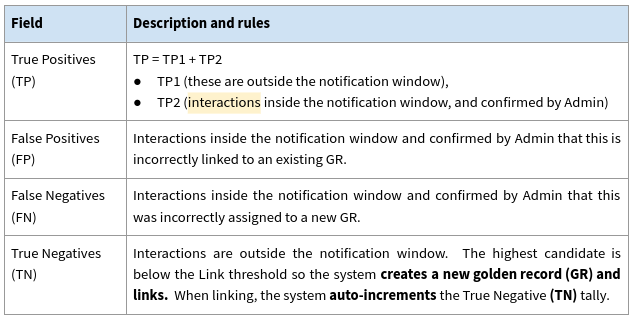

**Beta F-scores**

The f-score is a measure of a model’s accuracy on a dataset. It is the harmonic mean of precision and recall. There are 3 different f-scores displayed below, using the following formula:
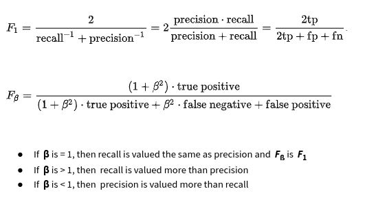

**Records and notifications** 

**Records**
- Displays the total number of Golden records and total number of interactions.
Notifications - Displays total number of notifications split by:

**Open Notifications**
- No. of New & Open notifications
Closed notifications
 - No. of Closed notifications

Note: The number of new and open notifications (basically notifications that are not closed) affects the accuracy of the F-score and depending on the % of notifications that have not been actioned.  

**Dashboard Tab 2: M & U values**

This screen provides us with a view of the M & U values as per the last periodic update.  

**Tally Method**

The Tally method computes M & U's per field, which is used for cross-checking against the M&U's computed by the EM algorithm. These M& U's are not used for probabilistic linking.  

It calculates the probabilities based on whether the fields in the pair match or do not match:
For each field where the pair matches (above notification), check if you increment A or B (refer to Tally method diagram below)
For each field where the pair do not match (below notification), check if you increment C or D
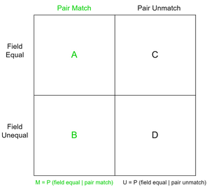

**What happens when the score is within the notification threshold area?**

When in the notification area, we are either above the notification TH or below the notification TH. 

**Above the threshold (using the incoming interaction and linked GR)**

- Assume this is correct for 80% of the time - increment A or B by 0.8
- Assume this is incorrect for 20% of the time - increment C or D by 0.2

If admin confirms this assumption, then the system must adjust the tallies by adding the 0.2 to A or B and removing 0.2 from C or D
If admin rejects this assumption, then the system must subtract 0.8 from A or B and add to C or D

**Below the threshold (using the incoming interaction and the candidate GRs)**

- Assume this is correct for 80% of the time -  increment C or D by 0.8 
- Assume this is incorrect for 20% of the time - increment A or B by 0.2
If admin confirms this assumption, then the system must adjust the tallies by adding the 0.2 to C or D and removing 0.2 from A or B
If admin rejects this assumption, then system must subtract 0.8 from C or D and add to A or B

**M and U values are calculated as follows:**

- M =  A/( A+B)
- U= C/(C+D)

**Dashboard Tab 3: Import Process Status**

This screen displays the progress of the processing of the file uploaded via the Import screen.

 

**Section 3: Browse**

**Browse Patients**

 

 This screen displays a list of golden records, with the most recent golden record displayed on the top of the grid.

- Select the Browse option on the top navigation bar
- Screen is displayed with a list of current patient interactions.  This is the default view.
- The options on this screen are::
a. Select one of the patient interaction (row) to view more details of the patient
b. Filter the results to find specific patients and/or list of interactions

 Browse Patients screen with list of interactions
 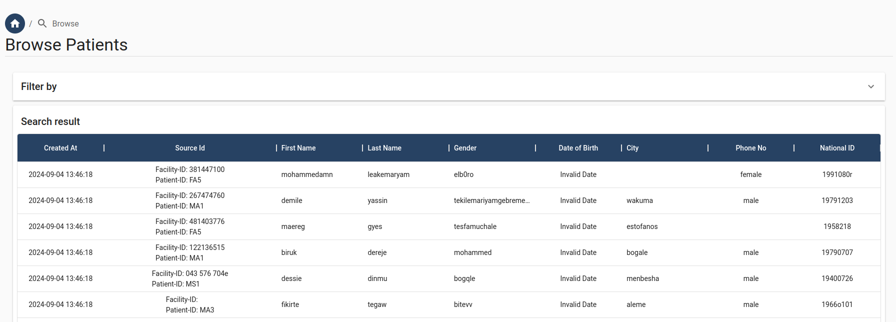

 **Filter by**

 

**Filter by option**

1. Select the Filter by panel
2. System expands the panel and displays the various options to filter the results:
- Filter by start and end date - dates can be selected using the calendar picker
- Get interactions - returns the golden record and patient interactions for the golden record
- Filter by a single field or combination of the fields below:
 a. UID, First Name, Last Name, Gender, Date of birth, City, Phone No.
 b. For each of the fields selected, the search can be further extended by selecting a type per field i.e.
  (i) Exact - returns results that exactly match the value entered
  (ii) Levenshtein 1 -  returns results with low fuzziness and a distance parameter = 1
  (iii) Levenshtein 2 - returns results with medium fuzziness and a distance parameter = 2
  (iv)Levenshtein 3 - returns results with high fuzziness and a distance parameter = 3 (default)
3. Enter the search criteria value for one or more fields that you want to search on
4. Select the **FILTER** button to view the results 
 a. If no results are found, the system displays a message informing the user that no results are available.  
5. Select the **CANCEL** button to clear the entered search criteria and repeat steps if required.

**Filter by (Get interactions)**

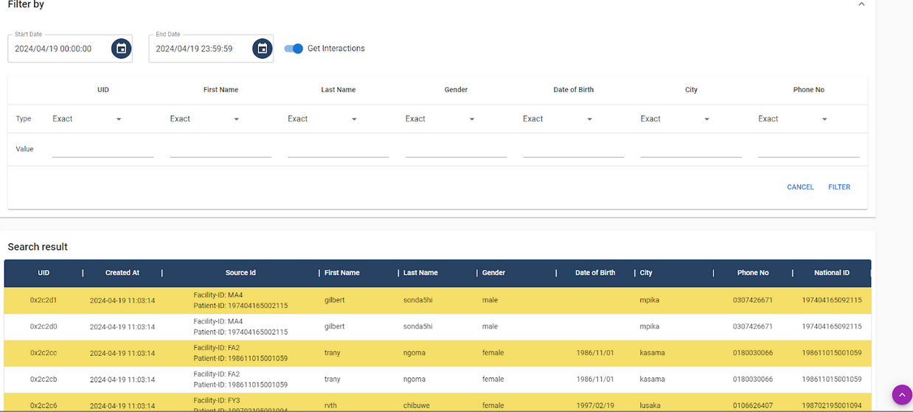

When the Get interactions toggle is switched on, the system displays the Golden record (GR) (row highlighted in yellow) and the linked patient interactions.  All patient interactions that belong to the GR are displayed under the GR.
To view the details of a patient, select the relevant row.
In order to view the details of a patient, select the relevant row.  System navigates to a detailed view of the selected patient’s interactions.

**View Details of Patient Interaction**

This is a detailed view of a patient.  The first row (highlighted in yellow) is the Golden record.  The rows below are the patient interactions.  In this example below, the patient has 1 interaction.

**How does this work?**

When a patient interaction is loaded for the first time, and there is no matching record, a golden record is created  using the patient interaction details.  
Thereafter, every matching patient interaction is linked to the golden record.  The golden record is updated based on the following rules:

1. If a golden record has missing values and the 2nd  interaction comes in with a populated value, the system will update the null value in the GR to match the field in the 2nd interaction.
2. Thereafter, if there are 2 or more interactions with a different field value to the GR field value, then the majority rule applies,  in that the field in the GR will be updated as per the majority. This update is configurable and can be disabled

On the Patient interaction screen, the user can do the following:
- View the details of the Golden record and its linked patient interactions together with the audit trail
- Edit the Golden record (with permissions)
- Relink the patient interaction

**View Patient Interactions and Audit Trail**

The golden record and the interactions are clickable.  
- When the Golden record is selected, the full audit trail for the patient is displayed, i.e., all the events that occurred on each interaction are displayed.
- When the Interaction is selected, the audit trail displays the event for that interaction only (refer to screenshot below).

**Editing a Golden Record**

Diagram x - Patient Interaction screen - Golden record

The user also has the option to update the applicable GR fields where edits are allowed.  No edits will be allowed on any system generated fields, e.g., Golden ID.  The fields that are editable are configurable.

**How does this work?**

After updating the GR field values, on save, the system does the following:
- re-computes scores for all automatically linked patient interactions
- updates the similarity score to indicate that the record has been manually updated (link score = 3.0)
- disables the Master auto-update fields flag to prevent auto-updates
- checks the new GR changed Patient record Threshold(TH) and if the scores for any of the linked patient interaction records fall below this TH, then sends a notification for Admin user to review.

1. Select the record
2. Select the edit option - the GR row becomes editable.
3. Enter or edit the field value as required
4. Select the save option
5. System displays a successfully saved message.

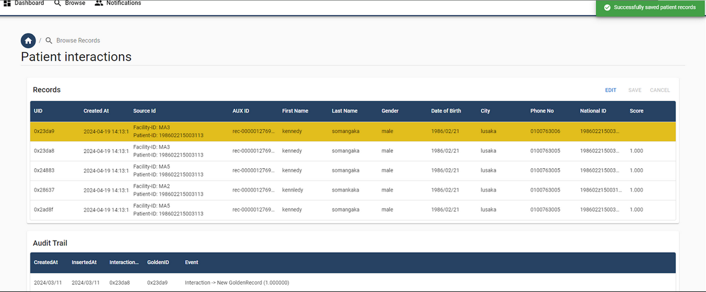

**Relink a patient interaction**

Relinking a patient interaction means that the interaction is not correctly linked to a Golden record and the Admin user wants to relink the interaction to an existing Golden record or create a new Golden record.  There are 2 ways that a patient interaction can be relinked:
1. From viewing an interaction - when the user views the interaction, the user may choose to relink the interaction (i.e. no notification received)
2. From a notification - a notification is received informing the user that some action must be taken.  The user can choose to relink the interaction to another golden record or create a new golden record to link to.

**Relink from Patient Interactions screen**

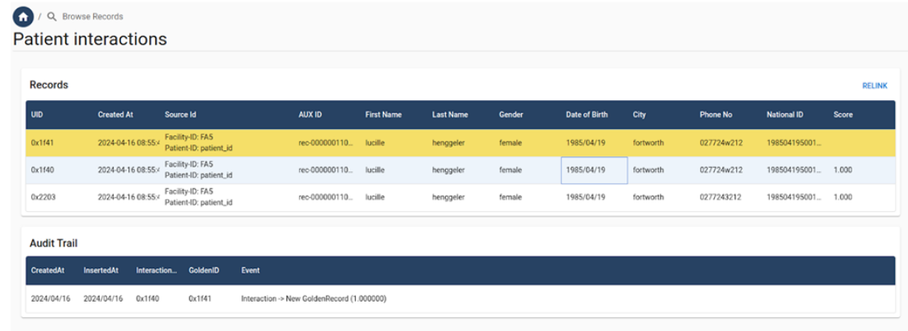

1. Select the Relink option
2. System displays the Review Linked Patient screen (below)

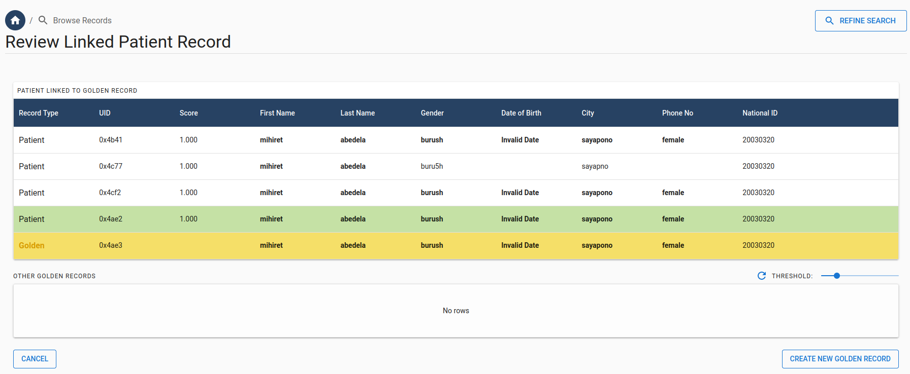

If there are no other candidate records displayed, the user has 2 options:
- Change the threshold and refresh to view the candidate golden records and/or
- Refine the search to view other candidate golden records

**Changing the threshold**

1. Select the Threshold slider 
2. Select the refresh button

3. The system will display candidate golden records if available.  These candidate golden records are displayed as "searched" as opposed to "blocked" when raised by a notification.

4. Select the LINK button on the candidate golden record that you want to link the patient interaction to
5. The system displays the interaction together with the new searched candidate golden record and prompts confirmation of the link.
  a. If the CONFIRM option is selected, the relink is done and system displays a successful message
  b. If the CANCEL option is selected, then no change is made, the confirmation dialog box is closed and the user is returned to the Review Linked Patient record screen. 
  

**Refine Search**

The user also has the option to search for more candidates by selecting the Refine search option.  There are 2 types of searches - custom search and a normal search function.

1. Select the Refine search button
2. Select either the Custom search or Normal search function

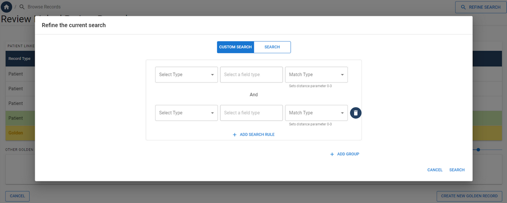

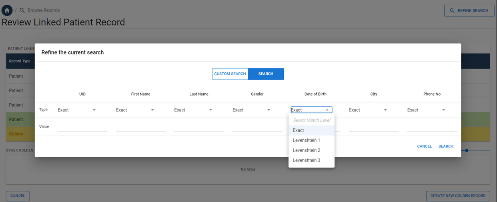

3. Enter the search criteria and select the Search button
4. System displays results as below

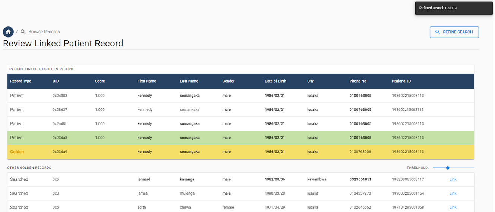

The same steps are followed to relink the patient as mentioned above. 

**Section 4: Notifications**

**Notifications Worklist**

Displays a list of notifications for user review with a reason for the notification.  On the worklist screen, there is a date filter that can be used to filter notifications between a specific date range. 

**How does this work?**

Records are flagged for review and notifications sent when: 
- Records are flagged for review and notifications sent when: Record is automatically matched to Golden record, but the matching scores fall within the Review threshold_
- The GR has been updated, scores are re-computed and matching scores fall below the GR changed Threshold
- When a notification is selected, the system displays a detailed view of the GR, the linked patient interactions and displays other candidate golden records if applicable.

The notification can be in 3 states:
- New - notification has not been read yet
- Open - notification has been read, but no action has been taken yet
- Closed - notification has been actioned and complete

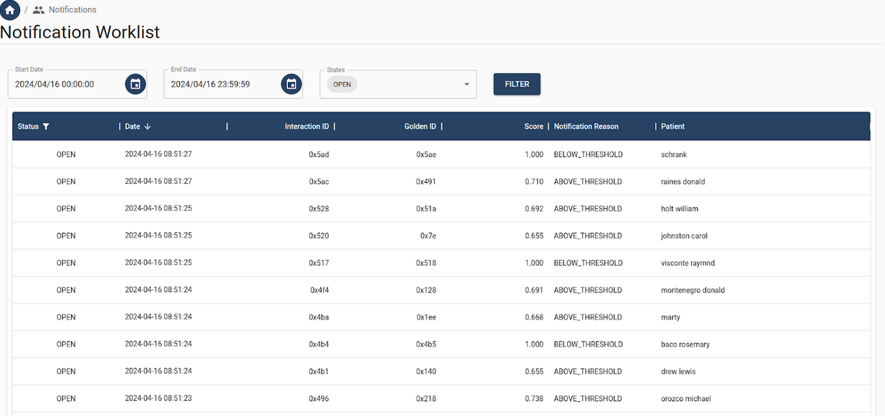

1. Select a notification
2. System displays the Review Linked Patient Record screen with details of the patient interaction.
3. There are 4 options on the screen:
- Refine search 
- Relink patient interaction to an existing Golden record
- Create new Golden record
- Close notification

**Refine search options**

This option is used when you want to extend the search criteria to search for possible candidate golden records.

**Refine search**

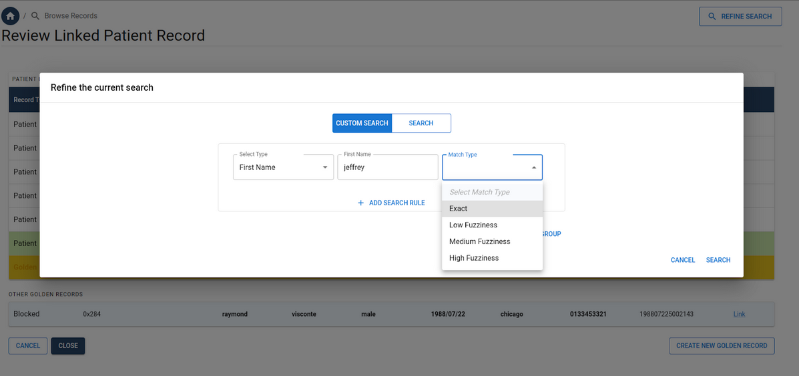
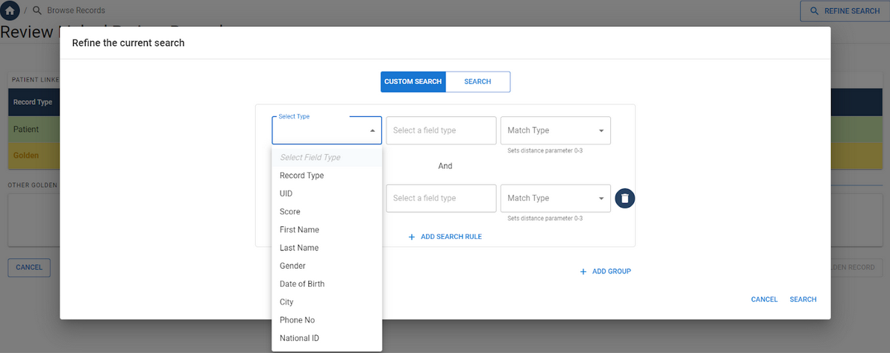

1. Select the **REFINE SEARCH** button
2. There are 2 types of searches that can be done, i.e., Custom search and a normal search
3. The system displays the Custom search option (default view)
4. Select the field type, enter a field value and the match type
5. You can also add more than one rule if applicable and select the SEARCH button
6. Alternatively, select the **SEARCH** option

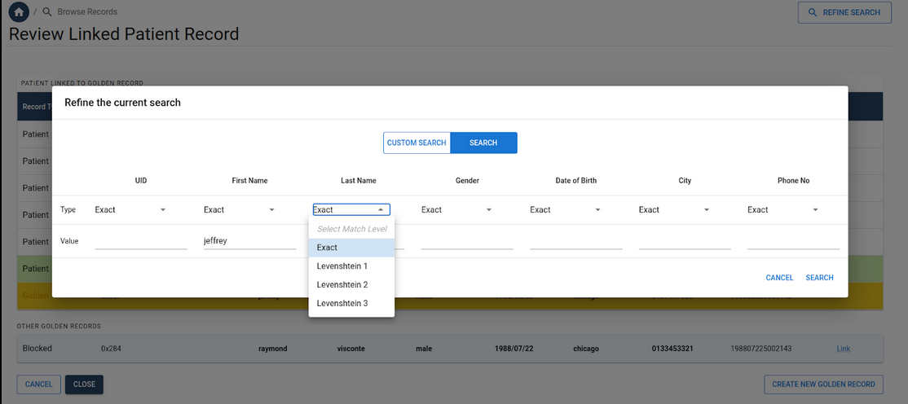

7. Enter or select the search criteria as per the screenshot below
8. Select the SEARCH button to view results
9. The system populates the results in the Review Linked Patient Record screen.  The results are populated as other candidate golden records labelled as “searched”.

 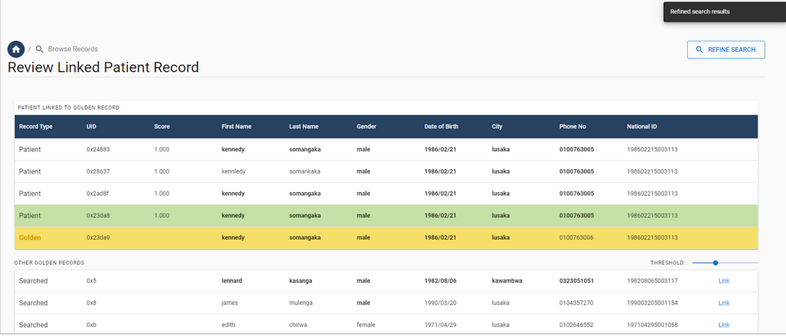

**Review Linked Patient record**

**Relink function**

The same process is followed as mentioned above under the Browse Patient interactions, the relink option.
The only difference in the process is that when relinking from a notification, the notification will change to a closed status.

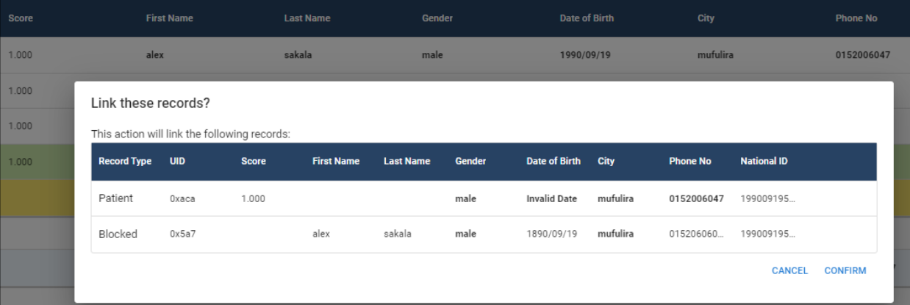

**Create New Golden Record function**

If there is no matching candidate golden record, then the patient interaction can be linked to a new golden record.
Note: this option is only available if there is more than one interaction linked to the GR. If there is only one interaction, then the creation of a new golden record option is disabled.

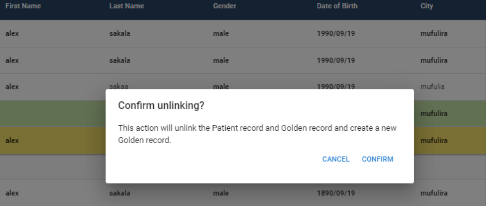

1. Select the Create new Golden record button
2. The system displays a message to confirm that the current link will be changed and a new Golden record will be created.
3. When the **CONFIRM** button is selected, the system:
- removes the link between the patient interaction and the current Golden record
- Links the patient record to the candidate golden record
- Updates the score to 3.0
- Updates the Notification state from New/ Open to Closed. 

**Close Notification**

When a notification is selected from the Notification Worklist screen, the Review Linked Patient record is displayed.

1. View details of patient interaction and golden record
2. The patient interaction is correctly linked, select the CLOSE button.
3. The system displays a confirmation message
4. Select the CONFIRM button.  
5. The system:
 - saves and updates the link score to 3.0.  
 - notification state is updated from New/Open to Closed. 

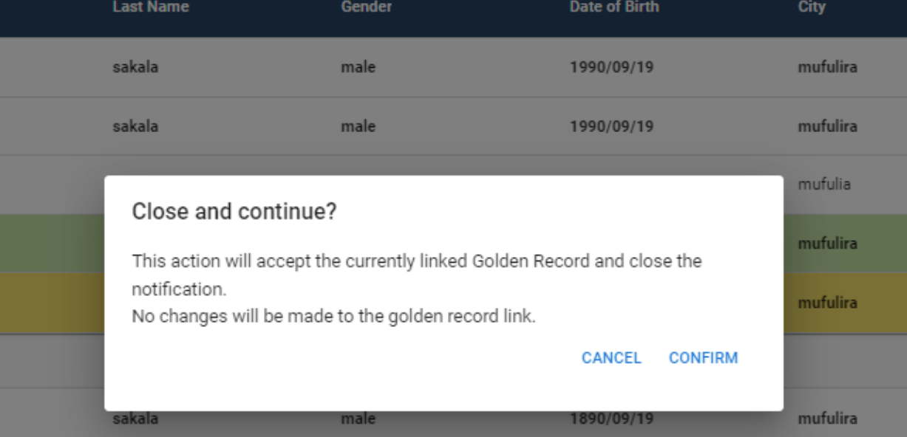

**Section 4: Import**

The Import data and metadata screen enables the user to select a file to upload, configure machine learning, set the threshold values and select how the results must be generated. All steps are mandatory and must be completed for the import process. 

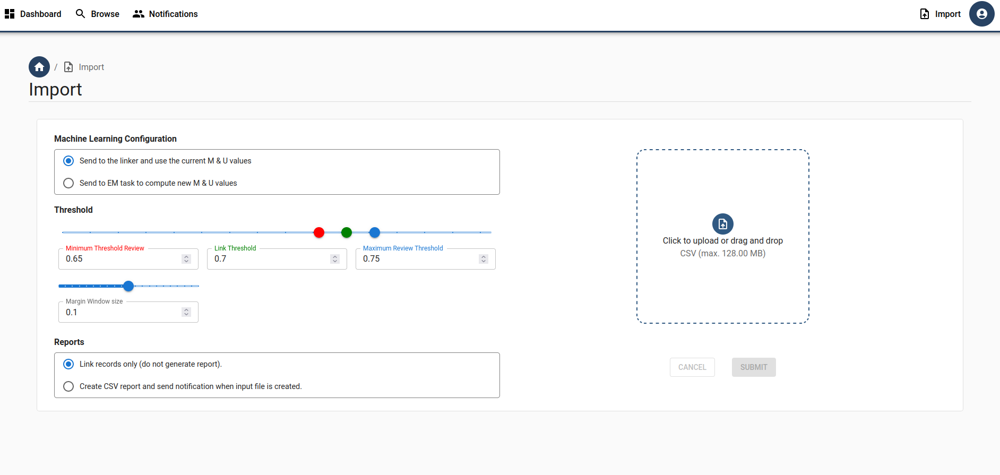

Select the Import option from the main navigation bar
System displays the Import screen

**Machine Learning Configuration**

Select one of the options below to configure machine learning:
1. Send to the linker and use the current M & U values
2. Send to the EM task to compute new M & U values

**Thresholds**

Enter the threshold values.  All values must be entered as per the rules defined.  
3. Rules on threshold slider
- Do not allow the link threshold (green circle):
- To be < the Minimum threshold review value
- To be > the Maximum threshold review value
4. Rules on Threshold
- For all threshold values that are entered, system allows for exponential notation e.g. 123E-3 which is the same as 0.012
- System display default values 
- Refer to the Fields and Validation table for more details on thresholds

5. If a value entered does not match the allowed values, then the system displays an error message informing the user that the value entered is not allowed. 

**Reports**

Select one of the options below to determine if a result file is required:
6. Link records only.  Do not generate a file.
- This option does not create a result file.  The system must link the records in the file only.
7. Create a CSV file and send a notification once the results file has been generated
- Creates the file.  The filename must include a STAN (<filename>-<datetime>-<row no.>), Interaction ID and golden ID. 
- System sends a notification when the input csv file has been created.  The notification must include the URL of the filename.

Select the **SUBMIT** button
8. This button is disabled until all required selections have been made, i.e., file must be uploaded, configuration selected, threshold values populated, and reports option selected.
9. When the SUBMIT button is enabled, select submit
System displays a confirmation message to confirm the upload. 

Select the **CANCEL** button

10. This action clears the selected and/or entered values.  User has the option to start again or leave the screen.

Once the file has been uploaded, the user can return to the Dashboard, Tab 3 and view the progress of the import process.

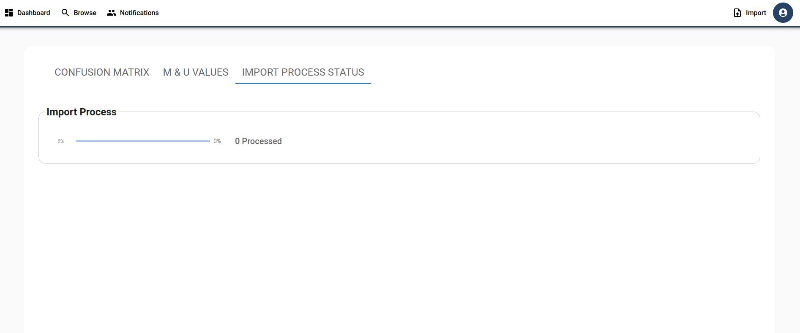

**Fields and Validation - Thresholds**

**Section 5: Configuration Settings**

The configuration settings screen enables the user to make edits to the default settings, 
the best fit the desired implementation of the MPI.

**Common Properties**

This tab defines the demographic details for a patient that will be used for linking.

**The user can do the following:**

- Select the Edit icon button to initiate edit mode on a row for the common properties.

When the row is in edit mode the following changes occur : 
- The colour of the row changes to white 
The edit icon changes to show a save icon and a close icon

- Choose to select the close button to exit edit mode.
- Choose to select the save icon button to save changes made and exit edit mode.
- Edit the relevant fields and select the save button to save changes on the current tab.

**Deterministic**

The deterministic tab is used to define the deterministic rules.
The deterministic tab has three sub tabs : 
- Linking 
- Validate
- Matching

**Source view** 

This view allows the user to do the following :
- View the displayed rules
- Click edit mode by clicking the edit icon button which opens up the design view
- Click add icon button which initiates edit mode , switches to design view tab (If there are no existing rules on display)

**Design view**

This view allows the user to do the following :
- Select the operator values from a drop down field eg “And” and “Or”
- Select common field values from a drop down field
- Select comparator function from a drop down field eg “Exact”, “Low Fuzziness” etc
- Add a second row of input fields by selecting the add add icon button
- Save rule by selecting the add rule button
- Exit edit mode and cancel previous edits.
- Delete existing row of input fields

**Blocking**
The blocking tab is used to define the blocking rules.

The blocking tabs have two sub tabs : 
- Linking 
- Matching

The blocking sub tabs have two different views :
Source view This view allows the user to do the following :
- View the displayed rules
- Click edit mode by clicking the edit icon button which opens up the design view
- Click add icon button which initiates edit mode , switches to design view tab (If there are no existing rules on display)!
[Blocking Source View](.gitbook/assets/23)

**Design view**

This view must allow the user to do the following :

- Select the operator values from a dropdown field, e.g., "And" and "Or"
- Select common field values from a dropdown field
- Select comparator function from a dropdown field, e.g., "Exact", "Low Fuzziness," etc.
- Add a second row of input fields by selecting the add icon button
- Save rule by selecting the add rule button
- Exit edit mode and cancel previous edits.
- Delete existing row of input fields

  **Probabilistic**
  In the Probabilistic tab, the user can define the linking threshold ranges and/or values.

  All values must be entered as per the rules defined.
  

  **Rules on threshold slider**
  - Do not allow the link threshold (green circle): 
  - To be < the Minimum threshold review value
  - To be > the Maximum threshold review value

  **Rules on Threshold**
  For all threshold values that are entered, system allows for exponential notation e.g. 123E-3 which is the same as 0.012System display default values
  
  **Nodes**
  This section displays the following :
 - Golden record node
 - Interaction node
 - Source ID

  

  Golden record node shows properties unique to the golden record.
  Interaction node shows properties unique to the interaction.Source ID :
  The third node denoted e.g., Source ID, shows unique common lists e.g., 
   - Source ID list
   - Biometric ID list
